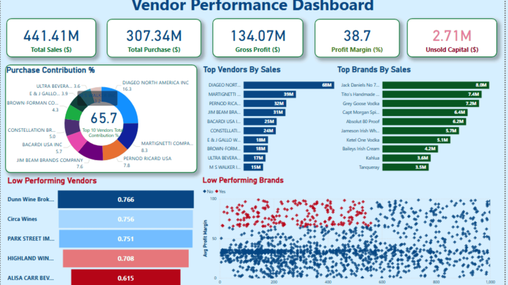

# Vendor Performance Analysis using Python and Power BI

## 📌 Overview
Vendor Performance Analytics helps businesses track vendor performance against key metrics like delivery, quality, pricing, and service reliability. It turns this data into clear insights, enabling companies to strengthen relationships, secure better contracts, reduce risks, and ensure timely, high-quality deliveries.

## 📂 Project flow 


## 📂 Project Structure
```
├── data/
│   └── vendor_sales_summary.csv
├── notebooks/
│   ├── Exploratory Data Analysis.ipynb
│   └── Vendor Performance Analysis.ipynb
├── scripts/
│   ├── get_vendor_summary.py
|   ├── get_vendor_summary2.py
│   └── ingestion_db.py
├── dashboard/
│   └── vendor_performance.pbix
├── reports/
│   └── Vendor Performance Report.pdf
└── README.md
```
## 🛠️ Tech Stack
- **Languages**: Python (Pandas, numpy, Matplotlib, Seaborn)
- **Tools**: Jupyter Notebook, Power BI, Excel
- **Other**: PDF Reporting, Powerpoint presentation 

## 💡 Key Features
- Automated ingestion and cleaning of vendor sales data
- Detailed Exploratory Data Analysis (EDA) to identify trends and patterns
- Python scripts for automated vendor summary reports
- Interactive and visually rich dashboard built using Power BI
- Finalized insights compiled in a professional PDF report

## 🚀 How to Run
1. Clone the repository
2. Open Jupyter Notebook and run EDA and analysis notebooks in `/notebooks`
3. Use `get_vendor_summary.py` to generate vendor summary from data
4. Open `.pbix` file in Power BI for dashboard view
5. Review the final report in `/reports`

## 📈 Outputs
- Vendor performance summary CSV
- Power BI Dashboard
- Final insights PDF report

## 📈 Show Outputs
  

  ## 📬 Contact
For queries or collaboration, feel free to connect via [LinkedIn](www.linkedin.com/in/anil-jaiswal-367952255).
